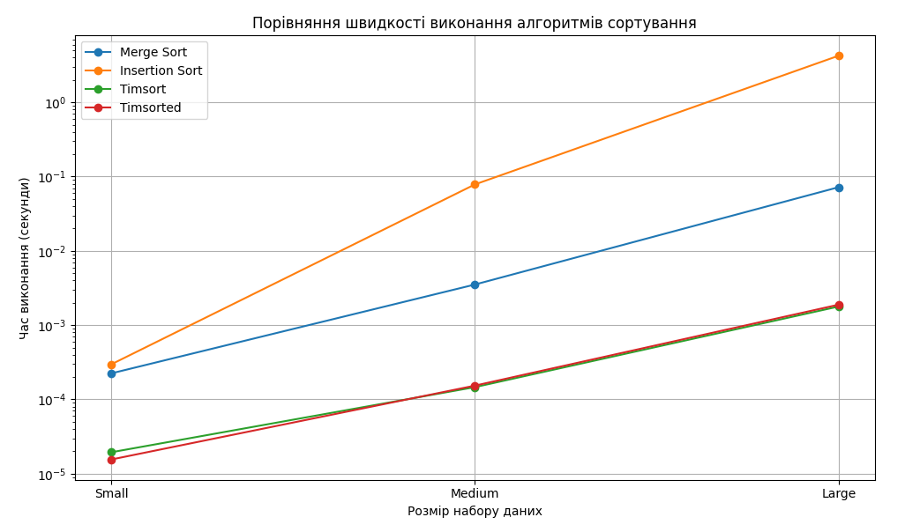

# Порівняння ефективності алгоритмів сортування

У цьому дослідженні було порівняно чотири алгоритми сортування: сортування злиттям, сортування вставками та Timsort (sort і sorted). Для цього були проведені емпіричні тести на трьох різних наборах даних: Small, Medium та Large.

## Порівняння часу виконання алгоритмів сортування

| Набір даних | Сортування злиттям | Сортування вставками | Timsort     | Timsorted   |
| ----------- | ------------------ | -------------------- | ----------- | ----------- |
| Small       | 0.0002238 с        | 0.0002959 с          | 0.0000194 с | 0.0000155 с |
| Medium      | 0.0035196 с        | 0.0783955 с          | 0.0001462 с | 0.0001532 с |
| Large       | 0.0719896 с        | 4.2411533 с          | 0.001781 с  | 0.0018852 с |

## Графік порівняння швидкості алгоритмів

## Висновки

1. **Timsort** виявився набагато ефективнішим за часом виконання порівняно з обома іншими алгоритмами на всіх розмірах наборів даних. Це підтверджується як на малих, так і на великих обсягах даних.

2. **Сортування злиттям** показує добрі результати на середніх розмірах даних, але стає менш ефективним на великих обсягах через свою складність O(n log n).

3. **Сортування вставками** є найповільнішим алгоритмом у всіх випадках, особливо на великих наборах даних, оскільки має складність O(n^2).

Отже, використання вбудованого алгоритму Timsort виявляється найбільш доцільним у більшості випадків, оскільки він комбінує в собі ефективність сортування злиттям і вставками.
